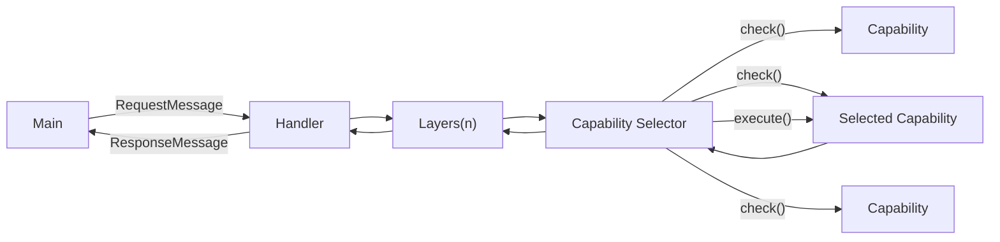
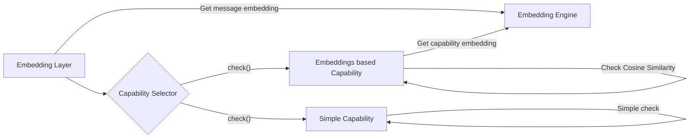
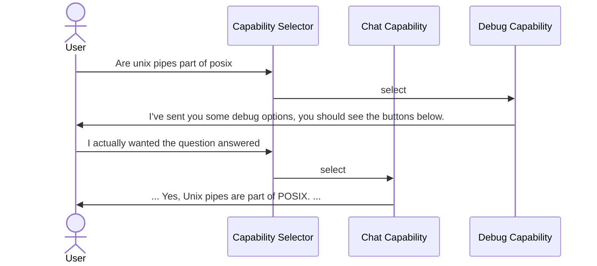

# Ratatoskr

Ratatoskr is a telegram bot written in Rust with the goal creating a generic AI driven bot architecture using a "design by experiment" philosophy. It was started initially as a rewrite of [Ratatoskr](https://github.com/divanvisagie/Ratatoskr) in Rust.


Part of this was simply for research purposes to see the difference between the memory usage of a Go and Rust implementation of the same application. The other part was to see how much of a difference the type system makes in terms of code quality and readability.

Writing in Rust also enables the _potential_ make use of the advances in local AI that have been made that make use of native integration such as local tokenization which seem to only be very good in python and rust at the moment.

## Architecture

### High level

Messages from Telegram are converted to a `RequestMessages` and passed to a handler. The handler then passes the message through a series of layers that can either reject the message entirely or modify it and pass it to the next layer. The final layer is a capability selector, which selects the capability that should handle the message. The capability is then executed and a `ResponseMessage` is passed back through the layers and back to the handler which then sends the response back to our main Telegram listener.

The listener then converts the `ResponseMessage` to a the type of response that makes most sense given the content of the `ResponseMessage`. For example if the `ResponseMessage` contains a `text` field, the listener will send a text message back to the user. If the `ResponseMessage` contains a list of options, the listener will send back a message that will cause Telagram keyboard options to be displayed to the user.



#### Layers

By having messages pass through the layers in both directions, layers have the power to check, modify or even save responses from capabilities. This allows for things like security, caching, and logging.

#### Capabilities

Capabilities are the parts of the application that respond to the user. They provide an interface that allows them to implement a check function that returns a score for how well they can handle a message and an execute function that returns a response message. This allows for multiple capabilities to be registered and for the best one to be selected for each message.

Allowing the capabilites to calculate their own score allows for simple capabilities
that, for example do an exact match on a command, to be registered alongside more complex capabilities that use machine learning to determine if they can handle a message.

```rust
pub trait Capability {
    async fn check(&mut self, message: &RequestMessage) -> f32;
    async fn execute(&mut self, message: &RequestMessage) -> ResponseMessage;
}
```

### Specific implementation

While the high level architecture can be applied anywhere, the specific implementation in Rustatoskr makes use of a specific strategy involving an `EmbeddingLayer`.

#### EmbeddingLayer

The `EmbeddingLayer` is a layer that converts the message to a text embedding and attaches this embedding to the `RequestMessage`. This allows capabilities to make use of embeddings to to calculate a `check()` score using [cosine similarity](https://en.wikipedia.org/wiki/Cosine_similarity)(A, B) = (A ⋅ B) / (||A|| ||B||) .



#### Memory Layer

The `Memory Layer` in Rustatoskr currently only saves the last 15 messages so acts as a short term memory, when it receives a message from a user it attaches the last 15 messages to the `RequestMessage` so that capabilities can make use of this information.

The core capability using this currently is the ChatCapability which uses this context to build up a list of messages to add to the request to give the user a more natural conversation experience.

When the `ResponseMessage` comes back through the layers, the `MemoryLayer` saves the user message and the assistant message to the memory.

#### Interesting unexpected behaviour

In [one notable instance](https://github.com/divanvisagie/Rustatoskr/issues/1#issue-1718132154) the fact that the incorrect capability was chosen for a message was able to be corrected by the user, since capability selection is only done on the current message, subsequent correction message was seen by the `ChatCapability` which was then able to correct the mistake because it had access to the previous messages.



#### Embedding Engine

Currently Rustatoskr uses OpenAI's embeddings API with the `text-embedding-ada-002` model. Future plans inclide testing out local embeddings to see if this reduces overall cost or latency.

## Dev Setup

### Continous dev:

```sh
cargo install cargo-watch
```

#### Windows

```powershell
$env:RUST_LOG="trace"; cargo watch -c -x run
```

#### Linux

```sh
RUST_LOG=trace cargo watch -c -x run
```

## Todo

- [x] Move message embeddings to be a one off by creating an embedding layer
- [ ] Create description embeddings on registration of a new capability, possibly long term hashed for even fewer calls to the api
- [ ] Try find a way to do embeddings locally that doesn't crash async
