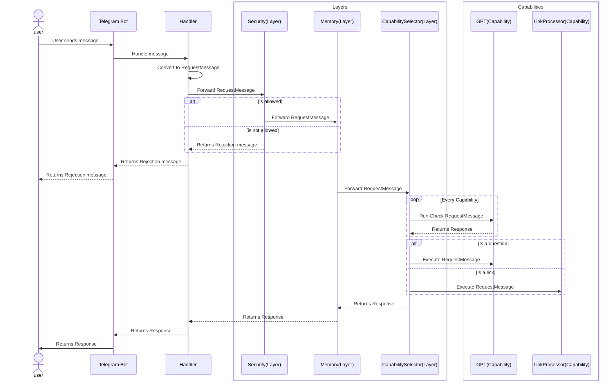

# Ratatoskr

[](https://railway.app/template/nYYnER?referralCode=JU48xV)


Ratatoskr is a Telegram bot designed to help you deal with web links that you would usually paste into the "Saved Messages" chat. It is named after the squirrel Ratatoskr from Norse mythology, who would run up and down the world tree Yggdrasil to deliver messages between the eagle at the top and the serpent at the bottom.

We don't have any mythological trees, but the idea is that when you paste a link here, Ratatoskr will take the appropriate action, for example for basic web pages it 
will read and summarise the link as well as save it for later reading in a notion database. For Youtube links it will process the video audio using OpenAI whisper, return a summary of the video and save the video and the summary to a notion database. For links to PDFs it will save the PDF to a notion database. 


## Architecture
The architecture is constructed by two main concepts, layers and capabilities. Layers are responsible for intercepting RequestMessages and processing them in some way. For example the MemoryLayer will store the messages that pass through it but also enrich RequestMessages with a context for the conversation history for that user.

Capabilities are responsible for executing a specific task, they also contain a `Check` function that determines if the capability should be executed for a given RequestMessage. For example the LinkProcessorCapability will check if the RequestMessage contains a link and if so it will process it.

    
### User Flow


## Running Ratatoskr
Ratatoskr runs as a simple go program and currently has no database, all storage is in memory. Therefore you only need to set up a few environment variables and you are good to go. You can easily deploy it in something like [Railway](https://railway.app?referralCode=JU48xV).

### Environment Variables
| Name | Description |
| --- | --- | 
| TELEGRAM_BOT_TOKEN | The token for the telegram bot which you set up with [BotFather](https://t.me/BotFather) |
| TELEGRAM_ADMIN | Your telegram username |
| TELEGRAM_USERS | A comma separated list of all the users you want to allow to use this bot |
| OPENAI_API_KEY | [API token](https://platform.openai.com/account/api-keys) for access to GPT 3.5 Turbo |


## Development Setup
Regular go programming environment, no funny business.

Install modules
```sh
go mod download
```

Run the program 
```sh
go run main.go
```


**For developing with hot reload Run**
```sh
go install github.com/cosmtrek/air@latest
```

```sh
air
```
