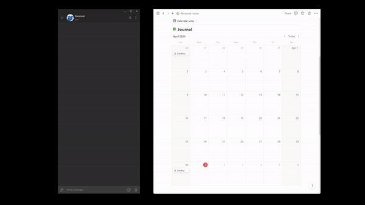
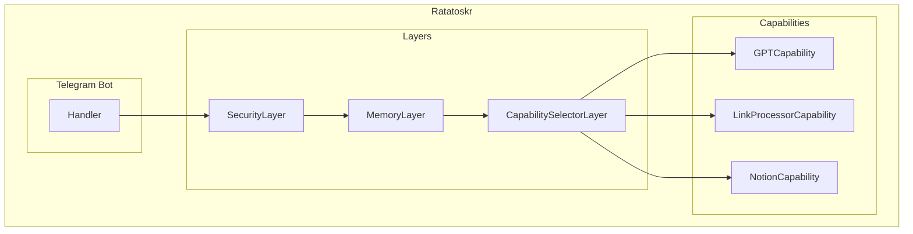
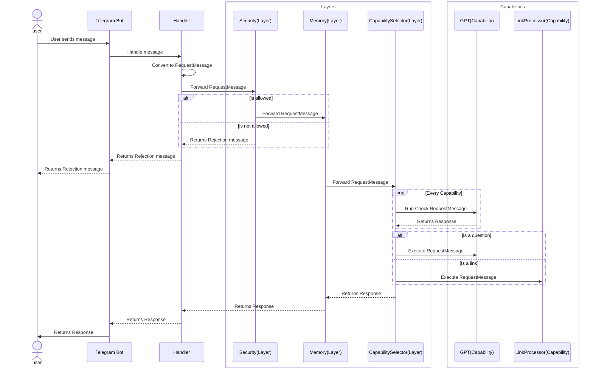

# Ratatoskr

[](https://railway.app/template/nYYnER?referralCode=JU48xV)


Ratatoskr is a Telegram bot designed to help you manage your bookmarks by leveraging OpenAI's GPT Models and Notion to keep a journal of your links and provide summaries of their contents. It is named after the squirrel Ratatoskr from Norse mythology, who would run up and down the world tree Yggdrasil to deliver messages between the eagle at the top and the serpent at the bottom.



Instead of just pasting links into the "Saved Messages" chat in Telegram, when you paste a link to Ratatoskr, It will attempt to read it and then Use ChatGPT to summarise it's contents, it will then save the link and the summary to a Notion database. These saves are non-destuctive as Ratatoskr is meant to be used not only as a bookmark manager but an enhancement to keeping daily notes inside of Notion.

## Limitations
Although it can support multiple users for returning summaries, Ratatoskr is currently only able to save links to notion for the designated Admin user. I designed it to solve a problem for myself and at present do not intend to expand my current instance to be a multi user platform, it is however easy to deploy yourself and due to the way the Telegram API is implemented, can actually be run on your local machine. I have however included a "Deploy to [Railway](https://railway.app?referralCode=JU48xV)" button at the top if the page since that is where I host my instance.

You can learn more about the setup in the [Running Ratatoskr](#running-ratatoskr) section.


## Running Ratatoskr
Ratatoskr runs as a simple go program and currently has no database, all storage is in memory. Therefore you only need to set up a few environment variables and you are good to go. You can easily deploy it in something like 
### Environment Variables
| Name | Description |
| --- | --- | 
| TELEGRAM_BOT_TOKEN | The token for the telegram bot which you set up with [BotFather](https://t.me/BotFather) |
| TELEGRAM_ADMIN | Your telegram username |
| TELEGRAM_USERS | A comma separated list of all the users you want to allow to use this bot |
| OPENAI_API_KEY | [API token](https://platform.openai.com/account/api-keys) for access to GPT 3.5 Turbo |
| NOTION_TOKEN | [Notion API token](https://www.notion.so/my-integrations) for access to your notion database |
| NOTION_JOURNAL_DB | The ID of the notion database you want to save links to, you might need to share your database with the integration you set up, so consult the Notion documentation [here](https://developers.notion.com/docs/create-a-notion-integration#step-2-share-a-database-with-your-integration) |


## Development Setup
Regular go programming environment, no funny business.

Install modules
```sh
go mod download
```

Run the program 
```sh
go run main.go
```


**For developing with hot reload Run**
```sh
go install github.com/cosmtrek/air@latest
```

```sh
air
```


## Architecture
The architecture is constructed by two main concepts, layers and capabilities. Layers are responsible for intercepting RequestMessages and processing them in some way. For example the MemoryLayer will store the messages that pass through it but also enrich RequestMessages with a context for the conversation history for that user.

Capabilities are responsible for executing a specific task, they also contain a `Check` function that determines if the capability should be executed for a given RequestMessage. For example the LinkProcessorCapability will check if the RequestMessage contains a link and if so it will process it. 




### User Flow

The flow below shows the flow of a message from the user to the telegram bot and then through the layers and capabilities. The flow is slightly different depending on if the message is a question or a link. Non authorised users will be rejected at the SecurityLayer and will not be able to proceed.





