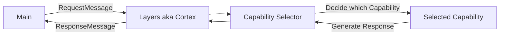
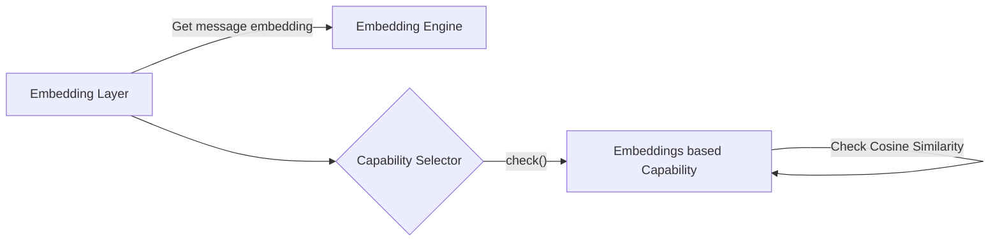
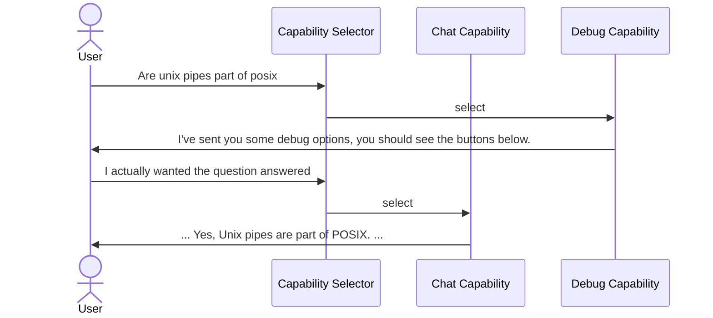

# Ratatoskr

Ratatoskr is a Telegram bot written in Go, aiming to create a generic AI-driven bot architecture using a "design by experiment" philosophy.

## Architecture

### High level

Messages from Telegram are converted to a `RequestMessage` and passed to a series of layers, each one called a "Cortex". These Cortices can either modify the message or pass it onto the next Cortex. The final Cortex is a "Capability Selector", which selects the appropriate capability based on the message content. The selected Capability is responsible for generating a `ResponseMessage`, which is then sent back through the layers, each having the opportunity to modify or process the response further. Finally, the processed `ResponseMessage` is sent back to Telegram.

```mermaid
graph LR
M[Main] -- RequestMessage --> L[Layers aka Cortex]
L --> CSL[Capability Selector]
CSL -- Decide which Capability --> C[Selected Capability]
C -- Generate Response --> CSL
CSL --> L
L -- ResponseMessage --> M
```

### Layers and Capabilities as Cortices

In Ratatoskr, both Layers and Capabilities are implemented as Cortices. A Cortex is an entity that processes messages and provides a channel for you to subscribe to its outputs. This unified interface makes it easier to conceptualize and manage the flow of messages through the system.

#### Layers

Layers are Cortices that handle operations such as security, caching, and logging. They have the power to check, modify, or even reject messages as they pass through.

#### Capabilities

Capabilities are also Cortices, but have the special role of acting upon the user's request. They decide whether they can handle a certain request and generate appropriate responses. 

Multiple Capabilities can be registered, and the most suitable one will be selected for each message, allowing for diverse response design, from simple command matches to more complex machine learning driven reactions.

### Specific Implementation

In the implementation of Ratatoskr, the architecture remains quite generic, but introduces a couple of specific features: the `EmbeddingLayer` and the `Memory Layer`.

#### EmbeddingLayer

An EmbeddingLayer is a Cortex that converts the text message into a numerical embedding that represents the semantic content of the message. This embedding is used by Capabilities to calculate their scores based on how closely the embedding matches their handling capacity.

```mermaid
graph LR
EL[Embedding Layer] -- Get message embedding --> EE[Embedding Engine]
CS{Capability Selector} -- "check()" --> C[Embeddings based Capability]
C -- Check Cosine Similarity --> C
EL --> CS
```

#### Memory Layer

Memory Layer is another important Cortex, acting as short-term memory for the application. It remembers the last `n` messages from a user and allows Capabilities to make use of this context while generating responses.

## Unexpected good Behaviours

In [one notable instance](https://github.com/divanvisagie/Rustatoskr/issues/1#issue-1718132154) the fact that the incorrect capability was chosen for a message was able to be corrected by the user, since capability selection is only done on the current message, subsequent correction message was seen by the `ChatCapability` which was then able to correct the mistake because it had access to the previous messages.

```mermaid
sequenceDiagram
actor U as User
participant CS as Capability Selector
participant CC as Chat Capability
participant DC as Debug Capability

U ->> CS: Are unix pipes part of posix
CS ->> DC: select
DC->> U: I've sent you some debug options, you should see the buttons below.
U ->> CS: I actually wanted the question answered
CS ->> CC: select
CC ->> U: ... Yes, Unix pipes are part of POSIX. ...
```

